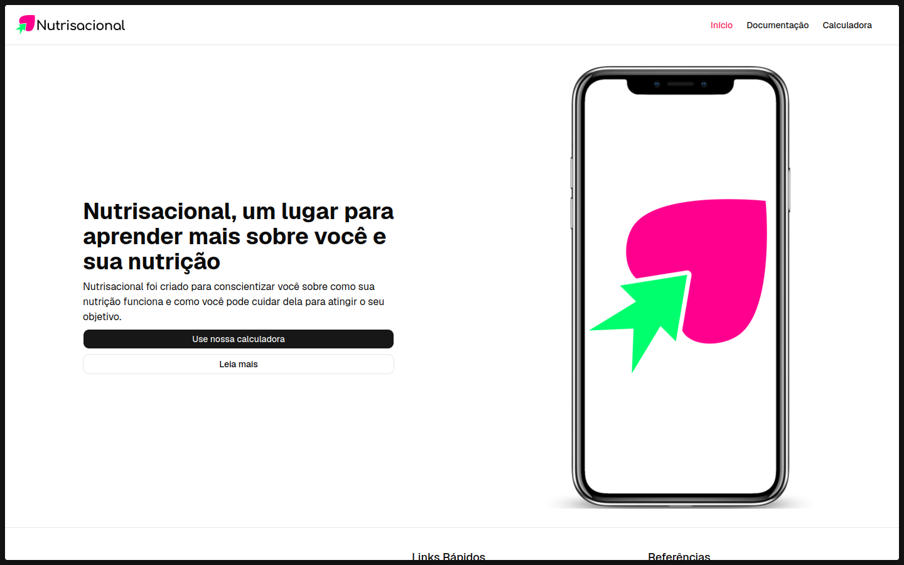
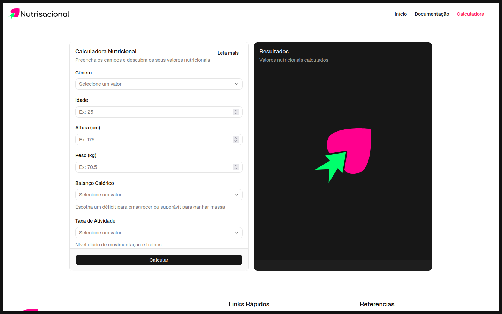
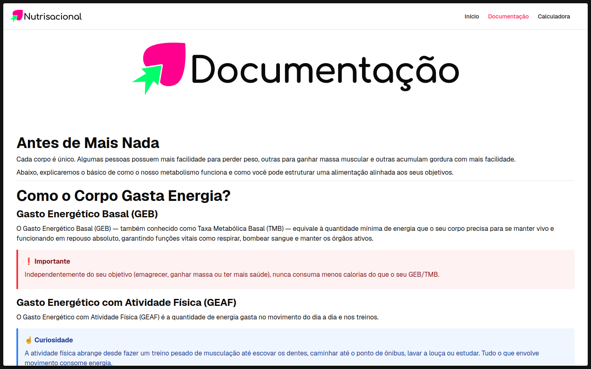

# NUTRISACIONAL

	

Projeto frotend feito para conscientizar as pessoas sobre a nutrição.

## Features

- Calculadora de calorias e nutrientes diários para se consumir (apenas uma estimativa)
- Documentação sobre nutrição
- Resposividade
- Implementação do APW
	- Utilização de cache / Otimização na rede
	- Possibilidade de utilizar o site mesmo sem internet

## Capturas de tela

## Ferramentas ⚒️

